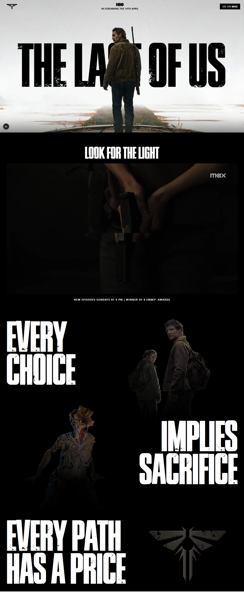

# The Last of Us — Landing Page

A cinematic landing page for the web series **The Last of Us**, built with [Next.js](https://nextjs.org/), [React](https://react.dev/), [Tailwind CSS](https://tailwindcss.com/), and smooth scroll/parallax effects.


[]()

## ✨ Features

- **Hero Section** with parallax backgrounds and custom title font
- **Video Section** featuring a series trailer
- **Choice Section** with impactful quotes and layered imagery
- **Smooth scrolling** using [Lenis](https://github.com/studio-freight/lenis)
- **Parallax effects** powered by [react-scroll-parallax](https://github.com/jscottsmith/react-scroll-parallax)
- **Responsive design** for all devices

## 🛠️ Tech Stack

- [Next.js 15](https://nextjs.org/)
- [React 19](https://react.dev/)
- [Tailwind CSS 4](https://tailwindcss.com/)
- [Lenis](https://github.com/studio-freight/lenis) (smooth scroll)
- [react-scroll-parallax](https://github.com/jscottsmith/react-scroll-parallax)
- TypeScript

## 📦 Installation


## Install Using NPM

### Clone the Repository
```sh
git clone https://github.com/SoumyadipDutta1004/last-of-us.git
cd last-of-us
```

### Install Dependencies
```sh
npm install
```

### Run the Application
```sh
npm run dev
```

Now, open your browser and navigate to `http://localhost:5173` to use the todo list.

---
Made with ❤️ by **Soumyadip Dutta**